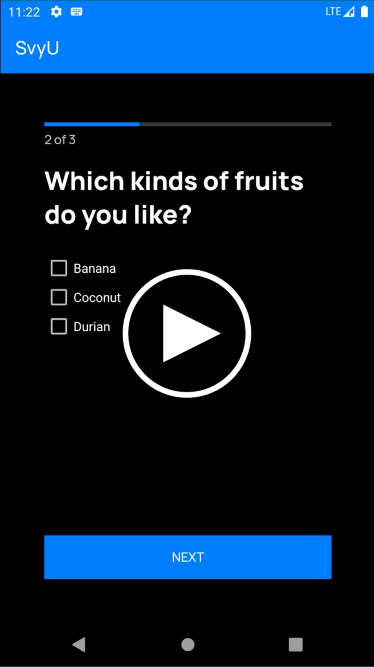

# SvyU
**Survey app built for Android.** Final project for Mobile Development course.  

## Demo

## Roadmap
- [x] Refactor
- [x] I18n for zh-CN
- [ ] Offline work
- [ ] Survey composer
- [ ] New question types
- [ ] UI scaling

## Collaborators
**For contributions before 3/25/2020**  

Amber  
David  
Martin  
Ofrila  
Walter  
